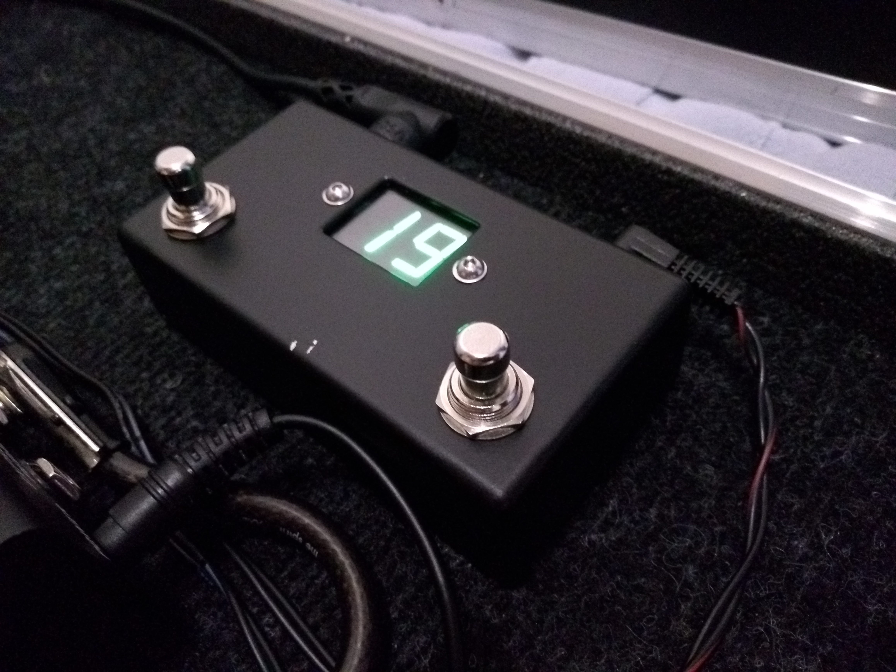
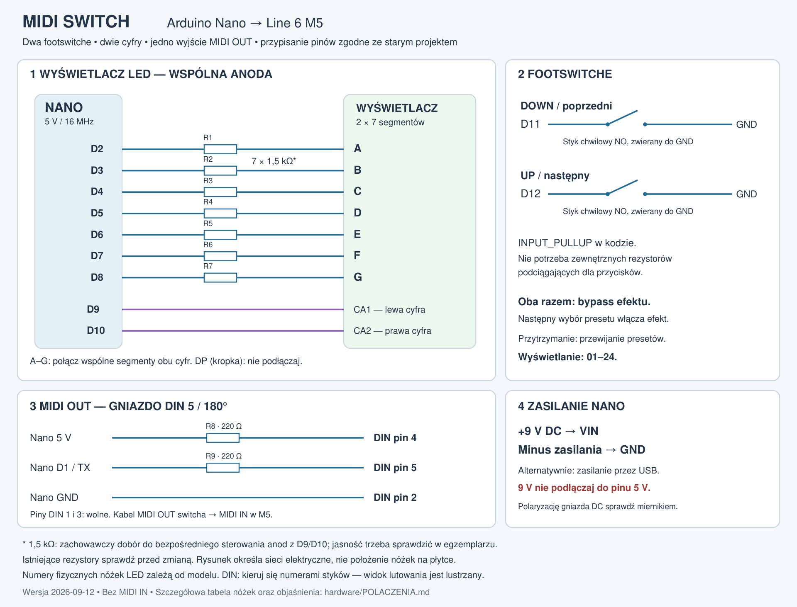
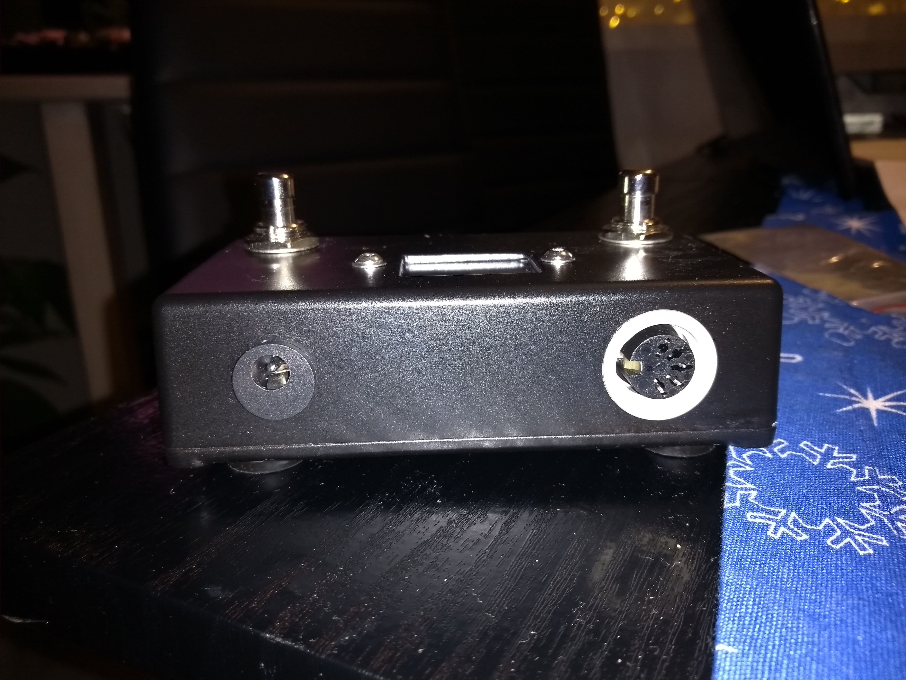
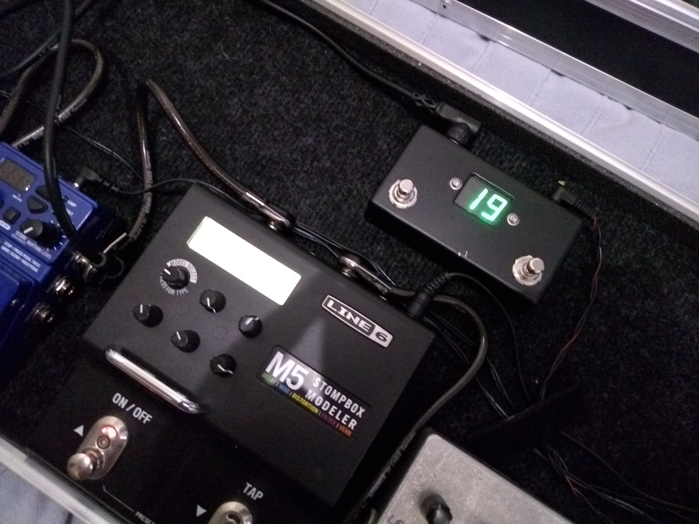

# Line 6 M5 Stompbox Modeler — Arduino MidiSwitch

Dwa footswitche, dwucyfrowy ekran LED i wyjście MIDI DIN. Uporządkowana wersja projektu Pawła z lat 2017–2018. Zdjęcia dokumentują oryginalne, działające urządzenie; nie są dowodem testu nowego oprogramowania.

## Projekt

- [Kod Arduino](MIDI_SWITCH.ino) — bez dodatkowych bibliotek.
- [Schemat połączeń PDF](hardware/schemat.pdf), [PNG](hardware/schemat.png), [edytowalny SVG](hardware/schemat.svg).
- [Połączenia, części i uruchomienie](hardware/POLACZENIA.md).
- [Analiza starych wersji i lista poprawek](docs/ANALIZA.md).
- [Wyniki i powtarzanie testów](tests/README.md).
- [Archiwalny kod](archive/READY_CODE_original.ino.txt).

## Obsługa

| Czynność | Wynik |
|---|---|
| Włączenie zasilania | Ekran 01; po około sekundzie PC 0 i włączenie efektu |
| UP, pin D12 | Następny preset; po 24 wraca 01 |
| DOWN, pin D11 | Poprzedni preset; przed 01 przechodzi do 24 |
| Przytrzymanie | Pierwsze powtórzenie 600 ms po zmianie, kolejne co 250 ms |
| Oba przyciski razem | Bypass, bez wyboru innego presetu; numer miga |
| Następny pojedynczy wybór | Zmiana presetu i ponowne włączenie efektu |

Obsługa obu przycisków ma okno 80 ms od rozpoznania pierwszego wciśnięcia. Krótkie naciśnięcie wykonuje się po zwolnieniu albo upływie tego okna. Eliminacja drgań styków trwa 25 ms. Jeśli drugi przycisk zostanie naciśnięty już po wykonaniu pojedynczej zmiany, sterownik czeka na zwolnienie obu i nie uruchamia wtedy bypassu. Przyciski trzymane podczas startu trzeba najpierw zwolnić.

Ekran pokazuje numer ostatniego presetu **wysłanego przez switch**. Urządzenie ma tylko MIDI OUT, więc nie odbiera zmian z M5. Numer presetu 01–24 jest czymś innym niż kanał transmisji MIDI 1–16.

## Wgranie

1. Po pobraniu projektu z GitHub nazwij jego katalog `MIDI_SWITCH` (Arduino wymaga zgodności nazwy folderu i szkicu). Otwórz `MIDI_SWITCH.ino` w Arduino IDE.
2. Wybierz klasyczne **Arduino Nano / ATmega328P / 16 MHz**, pakiet **Arduino AVR Boards**. To nie jest szkic dla Nano Every, ESP32 ani Nano R4.
3. Dla starego klona Nano zwykle potrzebna jest opcja **ATmega328P (Old Bootloader)**. Jeżeli płytka ma nowszy bootloader, wybierz **ATmega328P**.
4. Wybierz port USB i wgraj szkic. Podczas wgrywania odłącz kabel MIDI od M5, aby dane programatora nie trafiały do efektu.
5. W ustawieniach M5 ustaw kanał MIDI **CH1**. Domyślna stała `MIDI_CHANNEL` w kodzie wynosi 1.
6. Połącz **MIDI OUT switcha → MIDI IN M5** i wykonaj próbę opisaną w instrukcji połączeń.

Kod kompilowano dla Arduino AVR Boards 1.8.8: 3398 B Flash i 240 B RAM. Symulacja skompilowanego kodu: 45 sprawdzeń zakończonych powodzeniem. Nowy kod i schemat wymagają jeszcze próby na fizycznym egzemplarzu.

## Fotografie oryginału

Trzy zdjęcia przekazane przez autora zostały dołączone bez zmian. Historia Git oddziela archiwum i fotografie, porządkowanie firmware, dokumentację i testy oraz angielską wersję schematu. Nie nadano automatycznie licencji open source starym materiałom ani fotografiom.

## Źródła techniczne

- [Line 6 M5 Pilot's Handbook, sekcja MIDI Control](https://line6.com/data/6/0a060b316ac34f0593fa7e002/application/pdf/M5%20Pilot): PC 0–23, CC11 0–63 bypass / 64–127 on.
- [Arduino Nano — pinout](https://content.arduino.cc/assets/Pinout-NANO_latest.pdf): funkcje pinów i prądy I/O.
- [MIDI Association — specyfikacja DIN](https://midi.org/5-pin-din-electrical-specs).
- Archiwalny schemat użytkownika i lokalna karta `LD-D056Uxx-11.pdf`; szczegóły zgodności w `hardware/POLACZENIA.md`.
